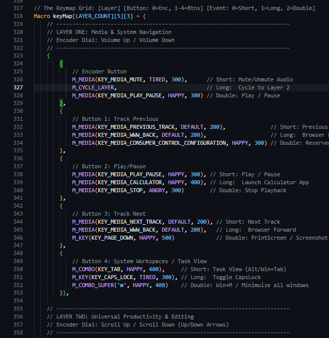

# RoboEyes MacroPad

   
  <i>A TTGO T-Display macropad with an animated robot display.</i>

So, RoboEyes MacroPad is basically a bluetooth macro keypad built on the ESP32. It’s powered by the [`RoboEyesTFT`](https://github.com/yousseftechdev/RoboEyesTFT) library, which makes the display act like a desk companion that actually reacts when you press buttons, switch layers, or when the battery is dying (which happens way too fast, tbh).

---

## What is this thing?
As said before, it's a bluetooth macropad with a cute robot face on it, by default, it has 4 switches, but more can be added as I designed the codebase to be very modular, the switch actions are also customizable, the encoder can be used for volume, arrow keys for scrolling, or customizing the robot face.

The robot face will look around while you work and be affected by your interactions with the switches and encoder.

---

## How does it work?
It works off of a TTGO ESP32 T-Display, the display is initialized with the `TFT_eSPI` library, the robot face is drawn by a custom lirary that i've made previously called [`RoboEyesTFT`](https://github.com/yousseftechdev/RoboEyesTFT), and the bluetooth commands are managed by the `ESP32-BLE-Keyboard`.

---

## Actions
You can press, double press, and long press any of the switches including the encoder switch.
To change layers/control modes, the default action is to long press the encoder switch, but that's customizable through the macro table in the code.

---

## Customization
You can customize the robot's face in the Layer 3/Yellow mode, press the buttons to choose which characteristic you want to change, whether it be the default facial expression, the border radius of the eyes, the distance between them, or even their width and height!

Hold the width and height button to change which one your editing.

To customize the macros, dig in the code base until you find the macro table/keymap grid at line 318, inside this 3D array you'll be able to decide what each action does, follow the comments and you'll know what to do.

---

## Setup guide
This is a pretty straightforward build, but it does need a little wiring and a bit of patience if it’s your first ESP32/macropad project. The good news is the code is already set up for the TTGO T-Display, so once the hardware is connected and the firmware is flashed, you’re mostly just tweaking the keymap and robot face settings.

You’ll need:
- A TTGO T-Display ESP32 board
- 4 momentary buttons/switches
- 1 rotary encoder with switch
- A common ground shared between the board and the buttons/encoder
- A battery or USB power source
- Soldering setup and some jumper wires

Wiring is pretty simple:
- The display is already mounted on the TTGO board, so you only need to wire the buttons and encoder to the GPIO pins defined in the code.
- The four switch inputs are on pins 27, 33, 12, and 13, the other leg of the buttons should be connected to a common ground.
- The encoder A/B pins are 25 and 26, and the encoder switch is on pin 32.

If you’re building this on a perfboard or custom PCB, keep the button wiring neat and make sure the grounds are all tied together. The ESP32 is pretty tolerant, but bad grounding and long loose wires can cause weird button glitches and random encoder jumps.

Once the hardware is ready, the firmware install is pretty normal:
- Open the project in VS Code with the PlatformIO extension installed.
- Make sure the project folder is recognized as a PlatformIO project.
- Connect the TTGO board to your computer with USB.
- In PlatformIO, build the project first to make sure the dependencies resolve cleanly.
- Upload the firmware to the board.
- If the board refuses to flash, try holding the boot button while initiating upload, then release it once the upload starts. This is a common ESP32 quirk.

After flashing:
From there, you can customize the macros in the keymap and tweak the robot behavior in the layer system. The default layer is a media layer, the second layer is productivity shortcuts, and the third layer is the face customization mode. Long-pressing the encoder switch is the default way to cycle layers, and the face reacts to your button presses and encoder movements so it feels a little alive instead of just being a screen on a board.

If you want to make it feel more like yours, start with the macro table and the face editing layer. That’s where most of the personality lives.

---

## Connecting
Just open the bluetooth settings on your computer and pair with it, once connected the robot will appear happy, when disconnected the robot will get sad, that's about it!
The device name entry will show `RoboEyes Macropad`, you can also change that in the code!