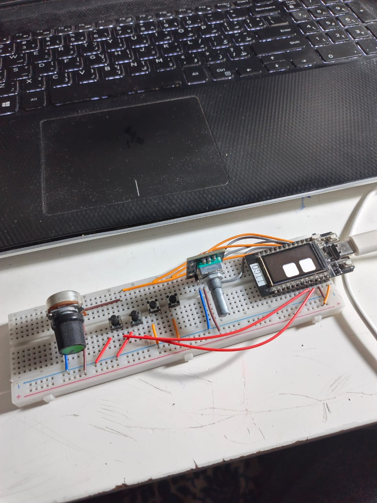

# RoboEyes MacroPad
<p align="center">
<i>A TTGO T-Display based macropad that doubles as a cute little robot desk buddy.</i><br>

</p>

Moving back and forth between the keyboard and mouse to click repetitive UI buttons gets exhausting fast, and memorizing endless shortcut key combinations is a pain. 

**RoboEyes Macropad** solves this by putting standard macros right at your fingertips while giving your workspace some personality. Built on top of the ESP32 and powered by the [`RoboEyesTFT`](https://github.com/yousseftechdev/RoboEyesTFT) display library, this macropad doubles as an expressive desk buddy that reacts dynamically to your button presses, layer switches, and system connections.

---

## Demo video
<video src="https://cdn.hackclub.com/019fd78b-134d-7983-aafd-85b7cd60dbba/VID_20260806_171026-compressed.webm" width="100%" controls muted playsinline></video>

---

## Features & Desk Buddy Behavior

* **3 Active Function Layers:**
  * **Layer 1 (Cyan): Media & Navigation** — Control system volume via the dial, skip/play tracks, launch apps, or minimize all windows.
  * **Layer 2 (Green): Universal Productivity** — Quick access to Copy, Cut, Paste, Plain Text Paste, Undo, Redo, Save, and Window management.
  * **Layer 3 (Yellow): Live Eye Customization Engine** — Interactively adjust eye spacing, corner radius, height, width, and default mood using the rotary encoder dial.
* **Expressive Animated Buddy:**
  * Displays dynamic expressions (**Happy**, **Tired**, **Angry**, **Default**) based on button events.
  * Look directions follow rotary encoder turns.
  * Integrated auto-blinking and subtle idle curiosity animations.
  * Saves eye shape and mood configurations directly to NVS flash memory (`Preferences.h`) so settings persist across reboots.
* **Multi-Input Gesture Detection:**
  * Each of the 4 dedicated buttons (plus the rotary encoder click) supports **Short Press**, **Long Press**, and **Double Press** actions—giving you 15 distinct hardware actions per layer.
* **Battery & System Safety:**
  * Auto-monitors battery voltage on Pin 34.
  * Eyes turn **Red** and assume a **Tired** expression when the battery drops low.
* **Pure Wireless Bluetooth Connectivity:**
  * Connects directly over Bluetooth LE HID.

> ⚠️ **Note on Hardware Design:** The standard ESP32 (ESP32-D0WD / ESP32-WROOM series) **does not feature native hardware USB OTG/HID capabilities**. Because it lacks USB HID device controller hardware, the micro-USB/Type-C port on board is used strictly for serial programming and power delivery. All keyboard and macro signals are transmitted **exclusively via Bluetooth LE (BLE)**.

---

## 🛠️ Hardware Requirements & Pinout

### Components
* ESP32 Development Board (e.g., TTGO T-Display or ESP32 with SPI TFT)
* TFT Display compatible with `TFT_eSPI`
* 1x Rotary Encoder (EC11 with push switch)
* 4x Tactile Push Buttons
* Battery & Divider circuit (connected to Pin 34)

### Default Pin Mapping

| Peripheral | Component Pin | ESP32 GPIO |
| :--- | :--- | :--- |
| **Rotary Encoder** | Channel A | `GPIO 25` |
| | Channel B | `GPIO 26` |
| | Switch (Button) | `GPIO 32` |
| **Tactile Buttons** | Button 1 | `GPIO 27` |
| | Button 2 | `GPIO 33` |
| | Button 3 | `GPIO 12` |
| | Button 4 | `GPIO 13` |
| **Display / System** | TFT Backlight | `GPIO 4` |
| | Battery Sense | `GPIO 34` |
| | Debug Toggle | `GPIO 35` (Hold LOW on boot for Serial logs) |

---

## ⚙️ Software Dependencies

Before flashing, install the following libraries in your Arduino IDE / PlatformIO environment:

1. **`TFT_eSPI`** — Hardware-accelerated graphics library.
2. **`RoboEyesTFT`** — Dynamic animated eyes engine for TFT displays ([GitHub Repo](https://github.com/yousseftechdev/RoboEyesTFT)).
3. **`ESP32-BLE-Keyboard`** — Bluetooth LE HID Keyboard emulator for ESP32.
4. **`Preferences`** — Standard ESP32 non-volatile storage library (built into the ESP32 Arduino Core).

---

## ⌨️ How to Customize Keymaps & Macros

All button bindings are configured in a structured 3D matrix inside the code: `keyMap[LAYER][BUTTON_INDEX][EVENT_TYPE]`.

### Keymap Matrix Breakdown
* **Layers:** `0` (Layer 1), `1` (Layer 2), `2` (Layer 3)
* **Button Indices:** `0` (Encoder Switch), `1` (Btn 1), `2` (Btn 2), `3` (Btn 3), `4` (Btn 4)
* **Event Indices:** `0` (Short Press), `1` (Long Press), `2` (Double Press)

### Macro Helper Definitions

You can easily assign custom actions using the built-in helper macros:

```cpp
// Send a single key press with an optional mood reaction
M_KEY(key, mood, duration_ms)

// Send a media key (e.g., KEY_MEDIA_PLAY_PAUSE, KEY_MEDIA_VOLUME_UP)
M_MEDIA(media_key, mood, duration_ms)

// Send a modifier shortcut (defaults to Ctrl on Win/Linux or Cmd on macOS)
M_COMBO('c', mood, duration_ms) // Ctrl + C

// Send a Windows/Super key shortcut (Win + Key)
M_COMBO_SUPER('d', mood, duration_ms) // Win + D

// Send a multi-modifier shortcut (Ctrl + Shift + Key)
M_COMBO_SHIFT('z', mood, duration_ms) // Ctrl + Shift + Z
```

#### Example: Modifying a Shortcut
To change Button 1 (Short Press) on Layer 2 to lock your workstation (`Win + L`):
Find the entry in `keyMap`:
```cpp
// BEFORE (Undo):
M_COMBO('z', DEFAULT, 200)

// AFTER (Win + L to Lock OS):
M_COMBO_SUPER('l', TIRED, 400)
```

To change the default modifier key globally from Ctrl to Cmd (for macOS), modify line 27:
```cpp
#define MODIFIER_KEY KEY_LEFT_GUI // Use macOS Command key
```
